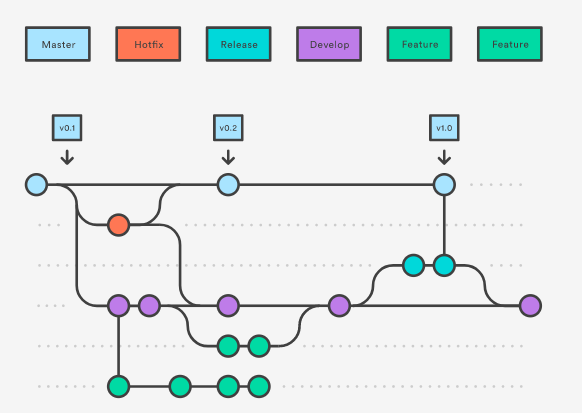

# Git Branching Model

> GitHub issues are the core of just about every action

* NOTE: The git-flow branching model is being used. For simpler use, install [git-flow tool](https://github.com/petervanderdoes/gitflow-avh)

## Types of branches

### Master branch

> We consider origin/master to be the main branch where the source code of HEAD always reflects a production-ready state.

### Development branch

> We consider origin/develop to be the main branch where the source code of HEAD always reflects a state with the latest delivered development changes for the next release. Some would call this the “integration branch”. This is where any automatic nightly builds are built from.

* When code in the development branch is stable and ready to release, all of the changes should be merged back into master somehow and then tagged with a release number(See release branch).

### Feature branches

> develop new features for the upcoming or a distant future release

* May branch off from: develop
* Must merge back into: develop
* Branch naming convention: anything except master, develop, release-*, or hotfix-*

#### Branch naming convention

> Use a consistent naming convention for your feature branches to identify the work done in the branch.

1. feature : New feature
2. bugfix : Changes linked to a known issue
3. hotfix : Quick fixes to the codebase

* feature/feature-name
* feature/feature-area/feature-name
* bugfix/description
* hotfix/description

### Release Branches

> Support preparation of a new production release(Uses semantic-release)

1. Create a release branch from the develop branch as you get close to your release or other milestones, such as the end of the sprint.
2. Give this branch a clear name associating it with a release, for example release/2.0(See semantic-release).

* May branch off from: develop
* Must merge back into: develop and master
* Branch naming convention: release-*
* The develop branch is cleared to receive features for the next big release
* The key moment to branch off a new release branch from develop is when develop (almost) reflects the desired state of the new release.
* It is exactly at the start of a release branch that the upcoming release gets assigned a version number—not any earlier.

### Hotfix branches

* May branch off from: master
* Must merge back into: develop and master
* Branch naming convention: hotfix-*
* Like release branches, but they arise from the necessity to act immediately upon an undesired state of a live production version

## Workflow

1. Create Issue
2. Create feature branch(from issue) from develop branch
3. Solve Issue
4. Make PR to merge feature branch into development branch
5. Create release branch
6. Merge release branch into develop and master for continuos deployment

* If there is some fast fix needed, a Hotfix branch can be made from master. This branch can be merged directly into develop and then Master.

## Sources

* <https://hackernoon.com/a-branching-and-releasing-strategy-that-fits-github-flow-be1b6c48eca2 | A Branching and Releasing Strategy That Fits GitHub Flow>
* <https://nvie.com/posts/a-successful-git-branching-model/ | A successful Git branching model » nvie.com>
* <https://github.com/JeffersonLab/remoll/wiki/Semantic-Versioning-and-Branching-Model | Semantic Versioning and * Branching Model · JeffersonLab/remoll Wiki>
* <https://www.atlassian.com/git/tutorials/comparing-workflows/gitflow-workflow | Gitflow Workflow | Atlassian Git Tutorial>
* <https://blog.seibert-media.net/blog/2014/03/31/git-workflows-der-gitflow-workflow-teil-1/>
* <https://medium.freecodecamp.org/adopt-a-git-branching-strategy-ac729ff4f838>

## Tools

* [VScode extension to set up gitflow project](https://marketplace.visualstudio.com/items?itemName=vector-of-bool.gitflow)